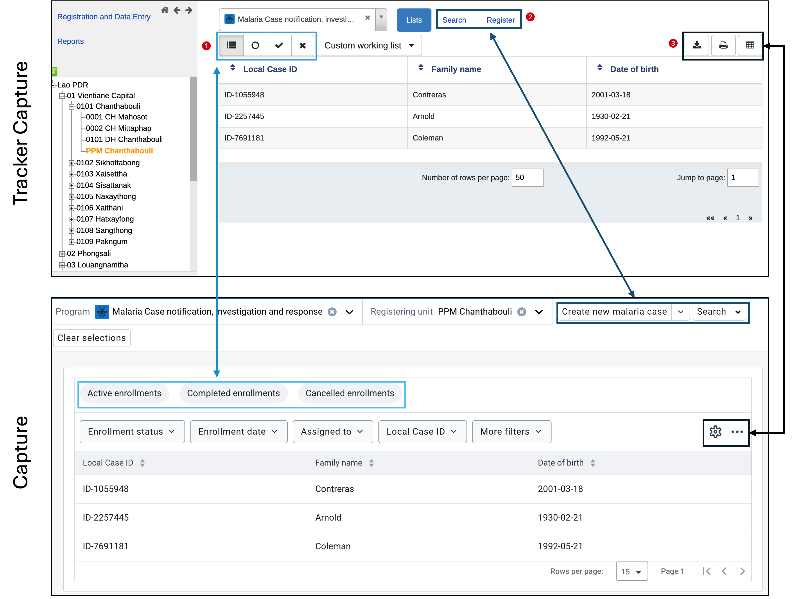

# Tracker Capture to Capture Transition Kit

***NB: This guide uses screenshots from a Lao PDR demo database. The Lao PDR Ministry of Health has graciously allowed us access to their reporting units, geography and metadata for the purposes of creating training material, guidance and performing testing; data items however are fictional and not representative of any person or value within Lao PDR.***

## Introduction

In DHIS 2.41, the capture app reached feature parity with the tracker capture app. This means that, in addition to the enhanced functionality that is being introduced within the capture app, all of the operations that were available within tracker capture can also be performed in the capture app. Further, in DHIS 2.42, the previous tracker capture API will no longer be supported. As a result, some planning is needed to transition users from the tracker capture app to the capture app, ensuring that users are aware of how the workflow and functionality that they are currently performing and using translates over to the capture app.

In order to successfully introduce the capture app, we recommend that implementation personnel outline a procedure of activities they can follow until the app is successfully implemented. An example set of tasks that we will use and outline in this guide include the following:

1. Understand the features of the capture app and how to use them
2. Understand how these new features are translated over from tracker capture
3. Understand which features are new to the capture app when compared to tracker capture
6. Understand the user permissions associated with capture app
7. Develop a plan to sensitize users to the capture app, via training and other communications
8. Create and implement training and communications materials to users to show them how to use the capture app
9. Evaluate users response to the capture app and support them as needed

## Features of the Capture App

In order to start a review of the features within the line listing app, first have a look at the [user documentation](https://docs.dhis2.org/en/use/user-guides/dhis-core-version-master/tracking-individual-level-data/capture.html). This document discusses some of the key features and outlines the interface within the capture app.

To further supplement the documentation, a series of videos that demonstrates the capture app functionality is available. These videos are located on YouTube. A playlist has been created [here](), while each of these videos can be found below.

### Feature comparison of the tracker capture and capture apps

## Operations walkthrough of tracker capture and capture features

In this section, we will compare several distinct operations in tracker capture and capture apps to show how they are performed and where items in the user interface can be found. 

### Selecting programs and org units

Here we can see how org units and programs are selected in each respective app. 

In ***tracker capture***, we have the org units on the left hand side bar, with the program being selected on the right. If you open the tracker dashboard, then you are brought to a new screen. and these selectors are not avaialable.

In ***capture***, we have a top bar where both the programs and org units can be selected. This top bar persists regardless of where you are in the capture app.

### Reviewing the interface

In addition to the org unit and program selectors, other items have been moved around

1. The working lists in capture are still directly above the front page line list. The working list features have been greatly expanded in capture. 
2. The Search and Registration buttons are located to the right of the registering unit/org unit dropdown. The order of the buttons has also changed. The registration button is now dynamic and will change its text based on the tracked entity type you are registering. 
3. Items including downloading the data or modifying which attributes appear on the front page line list have been collapsed into menu buttons in capture. 

### Registration

### Searching

### The dashboard

### Data Entry

### Relationships

### Enrolling in multple programs

### Working with Widgets

### Referrals and Transfers

### Working lists

