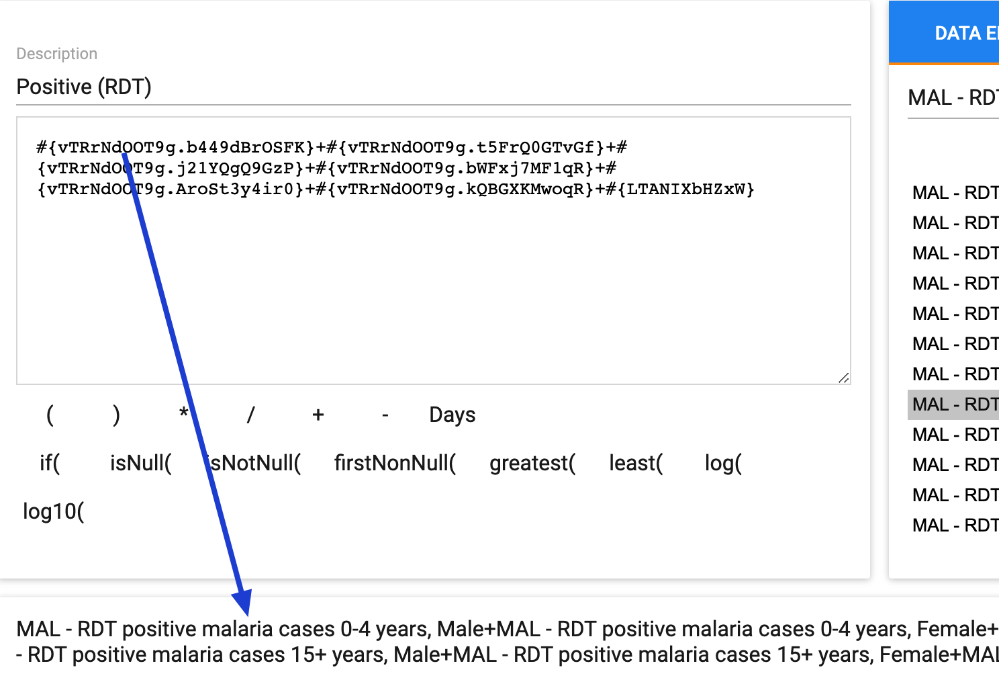
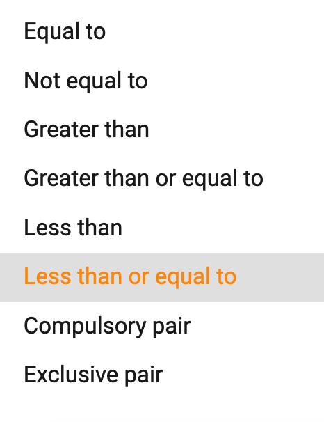
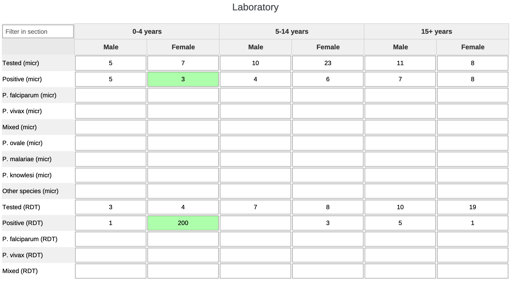
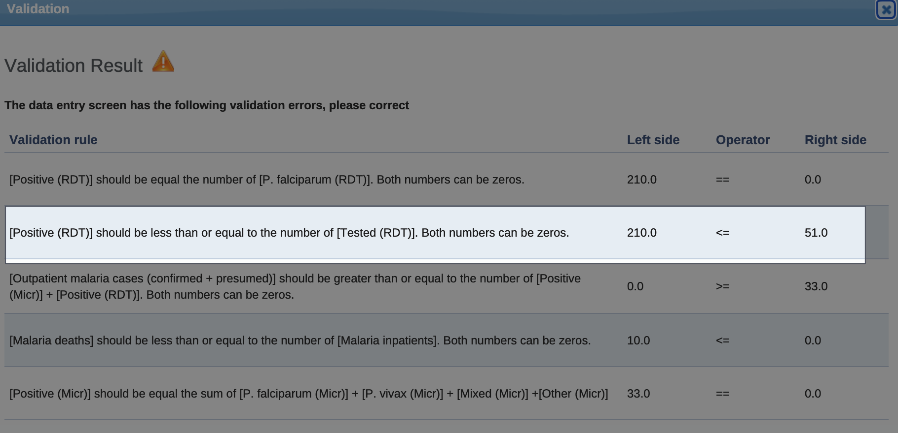
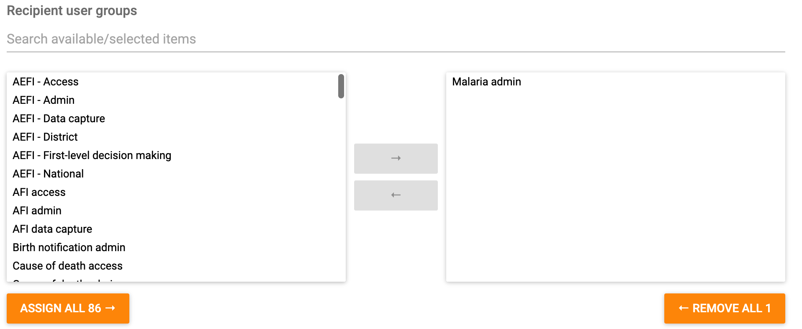
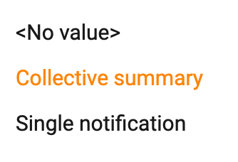
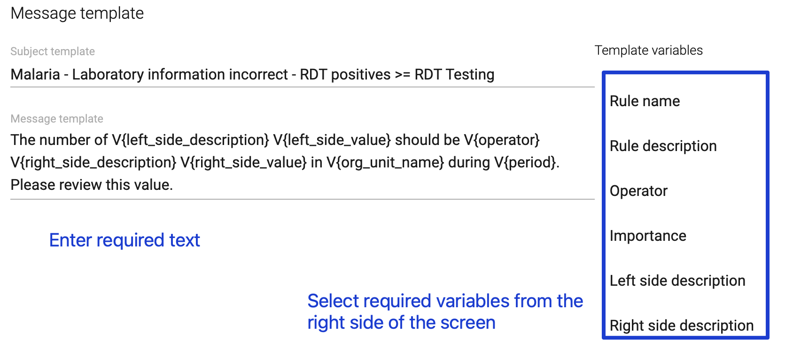
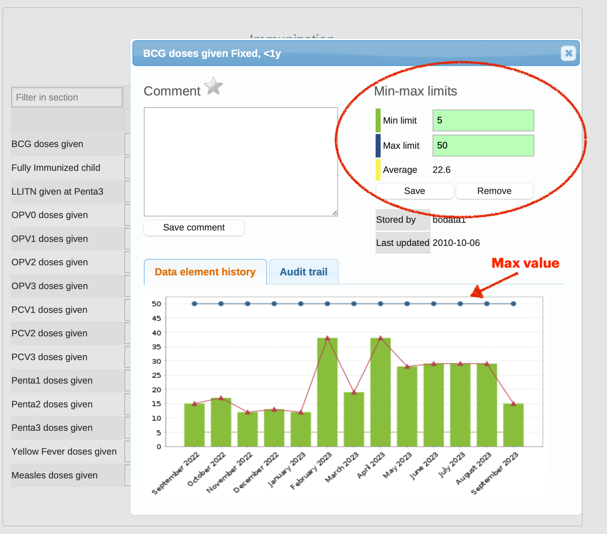
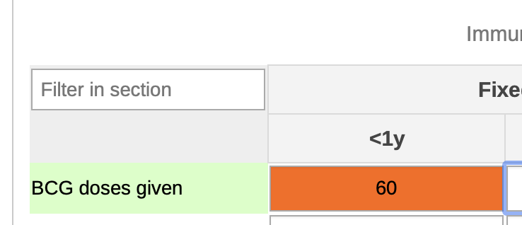
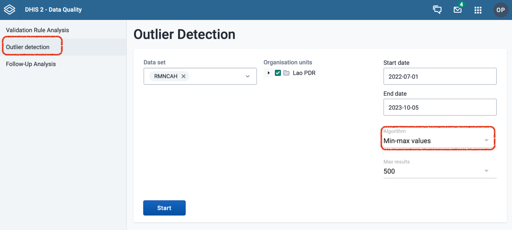

# Data entry for aggregate data

As much as possible, data quality issues should be detected and addressed as early as possible. By the time data is entered into DHIS2, it will often have been recorded first on patient cards or registers, then manually tallied into tally sheets, before the data is aggregated into weekly, monthly or quarterly values and recorded in aggregate facility reporting forms. Finally, data from these aggregate forms is entered into DHIS2. The design and quality of all these different tools, and the training provided and time allocated to staff to correctly perform these data collection activities are critical for the quality of the data.


## Design of data entry

Design of the data collection forms is an often overlooked element of good data quality. Design of paper-based data collection tools and forms is beyond the scope of this document, but well-designed paper based forms which are easy for data collection staff to fill out are an important factor in improving data quality. Forms which are extremely complex may be difficult to fill out on paper, leading to possible transcription errors on the original paper form. These errors may then be propagated into digital form (i.e. DHIS2) when electronic data entry takes place. 

[Data entry forms](https://docs.dhis2.org/en/use/user-guides/dhis-core-version-master/configuring-the-system/metadata.html#manage_data_set) in DHIS2 can either be auto-generated (default or section forms) or have custom design (custom forms). Using HTML and JavaScript, complex custom forms can be created by DHIS2 implementers which can mimic very closely the layout and design of a paper form. So-called section forms are auto-generated by DHIS2, and consist of sections of data which share a common type of disaggregation.  Section forms are generally easier to maintain and work well on mobile devices such as Android. Section forms should be the preferred option when possible. Section forms however may not align with the design of paper forms, which may complicate the process of data entry, thereby leading to a higher likelihood of mistakes being made during the transcription process.

Custom forms are sometimes necessary to be able to make a data entry form that makes it easy to transfer from paper to digital; however, custom forms are sensitive to changes in the underlying metadata (e.g. data elements and category dimensions).  This may lead to data being entered into the incorrect data element/category option combination without the user noticing it. Complicated custom forms may also require extra work to make “tabbing” between cells work correctly, which is important for efficient data entry without errors.

More generally, data entry forms that are overwhelmingly big (such as tables with 100+ rows x 10+ columns, not uncommon for recording morbidity data) come with the risk of the data entry user losing track of what row/column (e.g. disease and age/sex disaggregation) data is being entered into.

While we will not cover all the aspects of creating data entry forms here, consider some of these items in your design **_prior to_** configuring any data set in DHIS2 as this may aid in reducing some potential data quality issues before they arise.


* What are the data elements on the form?
* Which period is the form going to be collected?
* Are there any disaggregations associated with the data elements that need to be made?
* Which organisation units should be reporting on the form routinely?
* Are there any items that can be automated -- ie. indicators or calculated totals?
* Are there any items we should collect using other means (population data, cumulative totals, etc.)
* Design your dimensions with data use in mind, not data collection. 
    * This means that the disaggregation of data values at the time of collection should be easily aggregated up along the various dimensions ie. they add up to a meaningful total
* Reuse dimensions as much as possible as this increases the ability to compare disaggregated data (e.g. age groups, fixed/outreach, sex, etc.)

It is also critical that data elements are configured with the appropriate value types, to allow only the right type of data values to be saved. For example, making sure data elements used for capturing service delivery usage, cases/deaths, number of tests etc should be configured as zero or positive integers, to prevent negative numbers or decimals.


## Validation rules

[Validation rules](https://docs.dhis2.org/en/use/user-guides/dhis-core-version-master/configuring-the-system/metadata.html#about_validation_rule) are a critical component of ensuring that  individual data values which are related follow defined patterns. As a simple example, it is not possible to have more people who test positive for malaria than the number of people who were tested for malaria. Similarly, if there are any people who have tested positive for malaria, there should be at least as many people who were tested. 

In DHIS2, validation rules consist of two values (a left side and a right side) which are compared using a mathematical operator (less than, greater than, etc) to produce a logical true or false result. Validation rules compare values which are within DHIS2, at the level of capture and periodicity as defined by the validation rule. Using our examples above, a validation rule can look like the following in DHIS2:


If this data is collected monthly at the facility level, then it can be compared at least every month at the facility level, and additionally can be run at higher levels and lower frequencies if needed (for example, at district level for a year). 

Note that validation rules are not triggered when working offline in the web-based Data entry app; however they do work offline when using the DHIS2 android application on a mobile device. 


### Configuring validation rules

Let us create the validation rule example we have mentioned previously in DHIS2. As malaria testing can be performed using different methods, we will create this rule specifically for RDT tests.


1. Start by opening the Maintenance app and select the Validation tab.


2. Create a new rule by selecting the “+” icon underneath validation rule


3. Review the fields that will be used to describe the rule. You will need to enter a name, select the importance and period type and define your left side, right side and operator at minimum.

4. Add a name. The name must be unique among the validation rules in the system. Try to make it descriptive so you understand what it is representing. In this example, we could use the name “MAL - Positive (RDT) &lt;= Tested (RDT).” 

5. Add an instruction. This field is not required, but this is what the user will see in both validation analysis as well as when reviewing validation rules in data entry. For this reason, it is recommended that an instruction is always in place to make it clear to the user how to review the validation rule. 

6. (Optional) Assign the rule a short name, code, description.


7. Select an Importance: High, Medium or Low. This is a description of the validation rule that will be displayed to the user and does not affect priority or whether it is run or not.

8. Select a Period type. Note that you can not select a period type that is less than the frequency of data entry. If your data is collected monthly, you can not set the period as weekly for example. 

9. Create the left side of the expression:
    1. Click Left side.
    2. Select Sliding window if you want to view data relative to the period you are comparing. [See also About validation rules.](https://docs.dhis2.org/en/use/user-guides/dhis-core-version-master/configuring-the-system/metadata.html#about_validation_rule) 
    3. Select a Missing value strategy. This selection sets how the system evaluates a validation rule if data is missing.


| Option                         	| Description                                                                                                                                                                                                                                         	|
|--------------------------------	|-----------------------------------------------------------------------------------------------------------------------------------------------------------------------------------------------------------------------------------------------------	|
| Never skip                     	| The validation rule will never be skipped in case of missing data, and all missing operands will be treated effectively as a zero. This is the default option. Always select this option if you use the Exclusive pair or Compulsory pair operator. 	|
| Skip if all values are missing 	| The validation rule will be skipped only if all of the operands which compose it are missing                                                                                                                                                        	|
| Skip if any value is missing   	| The validation rule will be skipped if any of the values which compose the expression are missing.                                                                                                                                                  	|
   4. Type a Description.
   5. Build an expression based on the available data elements, program objects, organisation units, counts and constants. To do this, In the right pane, double-click the data objects you want to include in the expression. Combine them with the mathematical operators located below the left pane.


```
Note:

It is recommended to use the disaggregated data elements instead of the total data element as shown in the figure above i.e. all of the positive malaria cases by age and sex as we see here. This is because during validation rule analysis, when looking at the details, if the total data element was selected the details will be empty and you will not be able to drill down to identify where the problem originates from.
```

  6. As you add your data items from the right pane to the left pane, you will be seeing #{data element uid.category option combo uid}. This may not make a whole lot of sense, but if you scroll down you will see the name in plain text. 



7. Once you have selected all of your required inputs, select Save. The left side description should appear after saving the left side.


10. Select an Operator: Compulsory pair, Equal to, Exclusive pair, Greater than, Greater than or equal to or Not equal to.

    1. The **_Compulsory pair_** operator allows you to require that data values must be entered for a form for both left and right sides of the expression, or for neither side. This means that you can require that if one field in a form is filled, then one or more other fields that you have selected must also be filled.
    2. The **_Exclusive pair_** operator allows us to assert that if any value exists on the left side then there should be no values on the right side (or vice versa). This means that data elements which compose the rule on either side should be mutually exclusive from each other, for a given time period / organisation unit /attribute option combo. 
    3. In this example we will select less than or equal to




11. Create the right side of the expression, following the same process as for the left side (point 9 above)
12. With your left side, operator, and right side selected you should see the descriptions and operators for each of these items within the validation maintenance screen


13. (Optional) Choose which Organisation unit levels this rule should be evaluated for. Leaving this empty will cause the validation rule to be evaluated at all levels and is the most frequently used option. 

14. (Optional) Click Skip this rule during form validation to avoid triggering this rule while doing data entry. Normally this is not selected so the user can also review this validation rule during data entry

15. Click Save to save the validation rule


#### Creating validation rule groups

After we have created our validation rules, we should group them together. Grouping similar validation rules together helps in particular when reviewing the validation rules together in bulk analysis. 

Go to Maintenance> Validation> Validation Group


Select the add button and fill in the details of the validation group (the name, code and description).


Add in all of the related validation rules that you have made to group by selecting them from the left pane and moving them to the right pane. When you have added all of your related rules to the group, select “Save.” How to best define groups depends on how data elements and data sets are structured in a particular implementation. However, examples can be:

* Making a group with all validation rules link to data elements in one specific data set (for example a monthly data set for malaria reporting)
* Making a group with all validation rules linked to data element in one particular section of data set (for example a _malaria_ _section_ of an integrated HMIS data set)
* Making a group with all validation rules linked to data element across several related data sets (for example across separate _malaria testing_ and _malaria treatment _data sets)

#### Review validation rule violations in data entry

As each system will have a different configuration, validation rules will need to be made as outlined in the “Configuring validation rules” section in this document prior to reviewing any violations. Once you have made all of the validation rules you require, you will want to use them to check your data on a routine basis. We can review validation rules in both data entry as well as through validation analysis[SECTION LINK]. When reviewing validation rules, we will only be alerted to those rules that are violated; not those that pass the checks we have created. 

Let us take a look at our example again


We can start by reviewing our validation rules in the data entry app. We have set the period for the validation rule we have defined as “monthly” as the data for malaria is collected monthly. In our example, the data comes from the following table



In order to check if there is any issue with our data based on the validation rules we have defined, we can scroll either to the top or bottom of the data set within the data entry app and select “Run validation” [Note: validation rules will also run if you select “Complete” at the bottom of the data entry screen].


This will run any of the validation rules that are using data elements within the data set you have selected.

We can see the results within a pop-up window showing us the validation rules that have been violated when checked within data entry. 



We can see there are multiple violations, including the rule that was created previously. At this time, it would be a good idea to review each of these rules to ensure that the data values in this dataset have been entered correctly before finalizing the data entry process. If possible, incorrect values should be changed in order to minimize errors at the source of collection. 

Reviewing our example we can see an obvious error and would want to correct this to the correct value


If we go through and correct all the errors that were identified as part of running validation within this dataset, period and organisation unit combination and run validation again, we should get a message indicating that validation has passed successfully.


Ideally, we should strive to have validation rules created prior to performing training on data entry for a particular program, as it would allow you to perform training on validation violations and correction during training. During training, you should then make sure all data sets successfully pass validation where possible prior to submission. 

#### Review validation rule violations in data entry (beta)

Validation rules can also be run in the new data entry app (available from version 2.39). Do this by selecting either “Run validation” at any time or “Mark complete” if the data set is supposed to be completed. 


Results will show on the right side of the data entry app, indicating the number of High, Medium and Low priority violations as well as listing the violations highlighted in the appropriate colour depending on the priority they have been assigned. We will see the new app displays the violations slightly differently then the previous data entry app, showing the instruction, then the left side along with its value, the operator, and the right side along with its value. 


We would want to go through a similar process as described for the data entry app and review each of the values associated with these rules to determine if a correction can be made prior to proceeding with other operations in DHIS2.

### Validation rule notifications

Validation rule notifications provide a way to create messages that can be sent in response to a validation rule being violated. These notifications consist of the validation rule(s) which trigger the notification, recipient(s), and the message that is tied to the violation. The notifications can be sent out as messages to intended recipients using 3 mechanisms within DHIS2: e-mail, SMS and through the DHIS2 internal messaging service. Refer to the documentation for more information on configuring [e-mail](https://docs.dhis2.org/en/use/user-guides/dhis-core-version-master/configuring-the-system/system-settings.html?h=system+settings+master+use#system_email_settings) and [SMS](https://docs.dhis2.org/en/use/user-guides/dhis-core-version-master/maintaining-the-system/configure-sms.html). Here is an example of a validation rule notification sent out via e-mail.


Regarding the creation and use validation rule notifications, we need to be careful to ensure that the results within a message are not ignored. Usually, we would be conservative in the number of notifications we are creating so that users do not receive too many messages. Experience dictates that when this is the case, users tend to ignore these messages and areas that are actually problematic are not fixed. In general, create notifications for priority areas of correction and ensure that these notifications are being sent only to the users who need to see them. Other violations can be identified via routine data quality review procedures.

In order to create a validation rule notification, user groups are used to define the recipients. Please refer to the [documentation on user groups](https://docs.dhis2.org/en/use/user-guides/dhis-core-version-master/configuring-the-system/users-roles-and-groups.html#mgt_usergroup) to review how to create a user group in DHIS2. 

#### Configuring Validation Notifications

Go to Maintenance> Validation> Validation Notification


Select the add button to review the details of a new validation notification. There are a number of fields that we can break down. 

1. Name: This is the name for the validation notification you are creating
2. Code: You can also add in a code if required. The code can be used to uniquely identify the notification instead of the UID for example.


3. Validation rules: In this section you decide which validation rules you want to add to your notification. While you can add more than one validation rule to your notification, to make messages easier to interpret it is generally recommended that only one validation rule is within your notification. Keep in mind that there could be multiple violations within a given period if the users receiving the notification have access to several organisation units, and each violation would be identified in the message you are sending. 


4. User groups: This section defines who will receive the notification that you are creating. You must have user groups created in order to use validation notifications. You can review[ this section in the documentation](https://docs.dhis2.org/en/use/user-guides/dhis-core-version-master/configuring-the-system/users-roles-and-groups.html#mgt_usergroup) in order to review how to create user groups. Depending on the method you are using to send the message, the user must have the related relevant information filled in. For example, if you are sending notifications via e-mail, users within the user group you have selected need to have their e-mail filled in or they will not receive the notification.You can select multiple user groups if needed, but just keep in mind that you should only be sending out the notification to those who need to receive this information rather than trying to target a wide range of users who may ignore the message. 



5. Notification strategy: Here we decide how we want to send out our notifications when multiple validation violations are detected (for example over several org units and/or time periods). 
    1. Collective summary: This will generate a summary of all of the violations that have been detected for the period(s)/organisation unit(s) you are monitoring during your review of the validation rules. For example, if you detect 10 violations, these will be all summarized together in one e-mail/SMS/DHIS2 message
    2. Single notification: In this case, a message will be sent out for each and every validation violation that is detected for the organsation units and periods you are reviewing. For example, if you detect 10 violations, then 10 separate messages will be sent out. Use this option sparingly for high priority violations.



6. Notify users in hierarchy only: 
7. Message template: In this section, we define what the message will look like when it is sent out to our recipients. The template can consist of both template variables as well as plain text. The template variables will be replaced with the values collected from DHIS2.


We can review an example of an output message to review how template variables and plain text appear within a notification when it is sent out.



1. This represents the subject template in the message. Each violation will have this displayed prior to showing you the contents of the message template. 
2. In the template itself we have a mix of free text and variables. The first variable is the left side description. In the message, this is replaced with Positive (RDT). 
3. This is the left side value. It is replaced in the actual message with the value as taken from DHIS2
4. This is the operator for the validation rule
5. This is the right side description, replaced with Tested (RDT) in the message
6. This is the right side value, taken from DHIS2
7. This is the organisation unit
8. This is the period

We can see we can use a number of different variables to create our message and provide correct outputs to the person reviewing the notification. 

To create the template, populate the message with a mix of free text and by selecting appropriate variables from the right side of the screen. 


Once you are done filling in these fields, select "Save" to save the notification.


### Recommendation on validation rules configuration

Validation rules are a powerful tool to prevent data entry errors, but if they are not configured in an appropriate way they can also be a source of error by nudging users to “fix” mistakes.

In some cases, there may be validation rules that you would like to create which are _most often_ real data quality problems, but which may be falsely flagged by DHIS2. An example of this is the comparison between women making their first (ANC1)  and fourth antenatal care visit (ANC4). Seen as an overall population, we can say that the number of  ANC1 visits should be greater than or equal to the number of ANC4 visits. Every woman making a fourth visit has also made the first visit, but inevitably some women will not show up for their fourth appointment. Thus, ANC4 should always be less than or equal to ANC1; however, this is not appropriate as a validation rule, because ANC visits are spread over several months, and women may make different visits in different health facilities. For example, a health facility may have 100 ANC 1 visits and 74 ANC 4 visits in a year (ANC 1 ≥ ANC 4), but in one individual month there could be 9 women making their 4th visit and only 8 making their first visit (ANC 1 &lt; ANC 4). This is not a data quality problem, but would be recorded as such with a validation rule comparing ANC1 and ANC4. 

We recommend _not_ creating validation rules in these instances, as this may be confusing to the data entry user seeing the validation rule warning, and they may in the worst case edit the data to meet the validation rule criteria. If you _do_ create this type of validation rule, the message to users should clearly state that the validation rule warning should be examined, but may not be an actual data quality problem in all cases.

The [health data toolkits](https://dhis2.org/metadata-downloads/) - specifically the various aggregate metadata packages - includes validation rules for different health programmes 


## Min-max values

The “Min-Max” functionality of DHIS2 is a set of features that allows you to check for outliers in the data _during data entry_. The min-max value is based on setting minimum and maximum accepted values for a combination of data element, category option combination and organization unit. During data entry, values outside these minimum and maximum thresholds are highlighted in the data entry screen. Similar to validation rules, if a data value is outside the boundaries defined by the min/max values, DHIS2 will still allow the data value in question to be saved. However, the value will be highlighted in the data entry screen and a dialog box will be displayed which the user will need to acknowledge. 

There are two main advantages with the min-max functionality: 

* It allows data quality issues to be detected and flagged at the point of data entry, so that the user entering data can immediately verify the data, correct typos etc.

* Unlike validation rules, that can only be defined when there are multiple data elements with a logical relationship between them, min-max values can be set for any numeric data element for which a minimum of historical data is available.

Note: for data sets disaggregated with an attribute category combination, the min-max values applies to all attribute option combinations.


### Configuring min/max values

Min-max values can either be set manually in the data entry app, or using methods that calculate minimum and maximum values based on statistical methods from historical data. Note that for reasons outlined in further detail below, we ***do not*** recommend using the tool built in to DHIS2 to generate min-max values. We discuss these limitations [here](#limitations-with-minmax-values).


#### Configuring and viewing min/max values 

Min-max values can currently only be viewed within the data entry app; the dedicated “min-max analysis” component of the Data quality app has been deprecated.


#### Viewing and configuring min/max values in the data entry app

In the data entry app, double clicking within an input field (i.e. the cells for data entry) open a pop-up window with information about that particular data element and category option combination. 



The section in the top right corner of the window shows any currently set min-max limits, and allows users with the appropriate permissions to remove and/or save new min-max values. As explained below, these values will then be applicable to that particular combination of data element, category option combination and organization units. The _Data element history_ graph will also show the maximum value when set. 

#### Viewing and configuring min/max values in the data entry (beta) app

In the data entry (beta) app, information about min-max values is shown by highlighting an input field (i.e. the cells for data entry) and clicking the View details button in the toolbar at the bottom of the app. 


This opens a Details panel on the right side of the screen, with a dedicated section for min-max limits. Any user can see the currently set min-max values, and users with the appropriate permissions can also edit or delete them. 


#### Built-in generator

DHIS2 includes functionality to generate and remove min-max values in bulk for one or more data sets for a selection of organisation units. This functionality is found in the Data administration app. Follow these steps to generate or remove min-max values in bulk:


1. Navigate to the data administration app
2. Select the Min-Max Value Generation section
3. Select one or more data sets for which you want to generate min-max values. Min-max values will be generated/removed for all data elements with category option combinations in that data set
4. Select the organization unit boundary to generate values for. Min-max values will be generated/removed for all organization units below the selected orgunit, including the   all orgunit itself.
5. Select either Generate or Remove min-max values.

Note: min-max values are only generated for combinations for data element, category option combination and orgunit for which data already exists, and this happens independently of how the data set is assigned.


DHIS2 generates min-max values by determining the mean of all existing data values (for a given data element/category option combo/organisation unit combination) and then calculating lower and upper bounds based on a certain number of standard deviations from this mean. The number of standard deviations that is used is based on a system setting property called _Data analysis std dev factor_. The default value that is used is 2 standard deviations. This can be changed in the System settings app, under the General section.


##### Limitations with min/max values

As a general rule, we ***do not*** recommend using the Min-Max value generation tool with its current functionality, as it has several major limitations that causes it to generate min-max values that are too restrictive. This means too many values will be flagged as potentially wrong in the data entry app, which can both be a nuisance to data entry personnel and potentially lead them to incorrectly edit values so that they are within the limits. 

There are _some_ cases where this functionality might work sufficiently well to be used: if there is enough historical data to base the statistical analysis on, data is reasonably normally distributed (i.e. not seasonal, and not changing over time), and there are no facilities that always report very low numbers. In reality, however, there are very few cases where this is the case. In practice, one or more of these requirements are most often _not_ met:


* There will be certain small health facilities that consistently report very low numbers every month. In a hypothetical example of a health facility that reports values of 2 or 3 every second month in one year, the threshold based on 2 standard deviations above/below the mean will be 1,5 and 3,5. In other words, if the facility reports 1 or 4 in a month it would be outside the threshold. 

* Data is very often _not_ normally distributed. The typical example of this is data associated with rainy seasons, such as malaria. However, even data that is not typically considered seasonal will have certain months in the year with higher or lower numbers, for example reproductive health (including as a consequence immunizations, PMTCT etc).

* Min-max values will be generated for all combinations of data element, category option combination and orgunit for which there is any value. So for example, even is a health facility has only recently started reporting in DHIS2 and data only exists for a couple of months, min-max values will be generated - but from a very limited basis.

* Because the built in min-max generation can only be done based on the _mean_ of the existing data, it is sensitive to any existing outliers. 


#### Custom generation of min-max values

There is a [DHIS2 API](https://docs.dhis2.org/en/develop/using-the-api/dhis-core-version-240/maintenance.html?h=2.40#webapi_min_max_data_elements) that allows saving and removing min-max values. It is therefore possible to generate the min-max values outside using other tools, and then import them via the API. A limitation of this approach is that the API only allows you to POST or DELETE _individual_ values (for one data element, category option combination, orgunit combination). However, since this min-max does not need to be updated frequently (unlike for example analytics) it is possible to work around this limitation.


#### Prototype tool for min-max generation

A prototype to test improved methods for generating min-max values has been developed. This is a [python tool](https://github.com/search?q=owner%3Aolavpo+min-max&type=repositories) created with more flexibility in mind for the generation of min-max values. Detailed documentation on how to use this tool is available in the [github repository](https://github.com/search?q=owner%3Aolavpo+min-max&type=repositories).

This tool is designed to address the main shortcomings of the built-in min-max generation functionality:

* It allows setting different parameters according to the median values reported by orgunits; for example, min-max for small facilities can be set based on the previously highest values rather than standard deviations, and larger facilities can have a stricter threshold.

* It allows setting a minimum completeness of data for an orgunit before it tries to generate min-max values.

* It allows doing normalization of data using box-cox transformation before setting min-max values, to work better with data that is not normally distributed. 
* It supports using median in addition to mean as a basis for setting thresholds.

```
Note: the tool is for now only a prototype, and should be tested thoroughly in a test environment before it is used in a production environment.
```

#### Review min/max values in data entry

No user action is required to review min-max values in the data entry app: when a number outside the specified min-max value is entered, a pop-up window immediately appears with a warning message, and the cell is highlighted in dark orange. 





Upon marking the data set as complete or using the Run validation button, the min-max violations are also listed in a similar way as validation rule violations.


#### Review min-max values in the Data quality app

Min-max values can be reviewed in batch as part of Outlier detection in the Data Quality app. Min-max is available as one of the available “Algorithms”.




To perform an analysis of values outside the min-max thresholds:

1. select one or more data sets for analyse
2. select one or more organization units
3. specify start and end date
4. Select Min-max values as the Algorithm
5. Click Start

The result is presented as a list showing the data element, period and organization unit where a value outside the min and max thresholds have been reported.


The _Value_ column is the reported data value, _Deviation_ is how much above the max or below the min thresholds the number is, and the _Min_ and _Max_ columns show the min-max thresholds for the particular data element and organization unit. The table is sorted by Deviation, since the violations with the highest deviation have the biggest impact on the overall data. Follow-up allows data values to be marked for follow-up; they can then be review later using the [Follow-up analysis](https://docs.dhis2.org/en/use/user-guides/dhis-core-version-master/collecting-data/data-quality.html?h=follow-up+anal+master+use#about-follow-up-analysis) functionality.