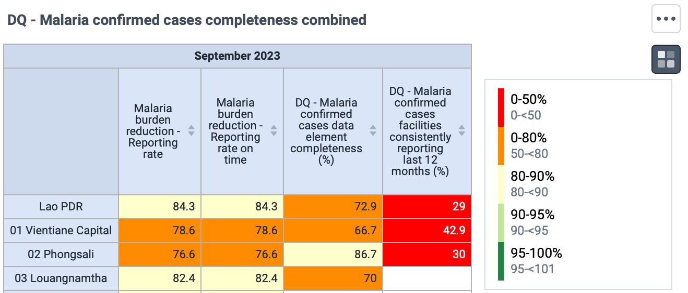
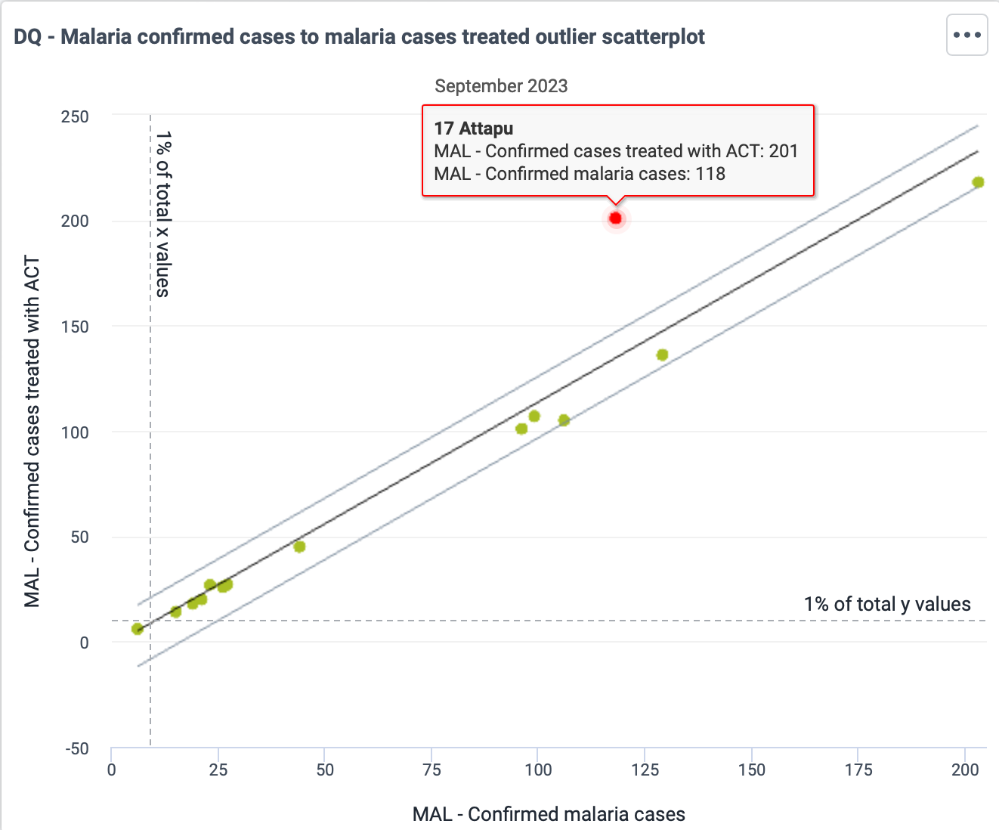
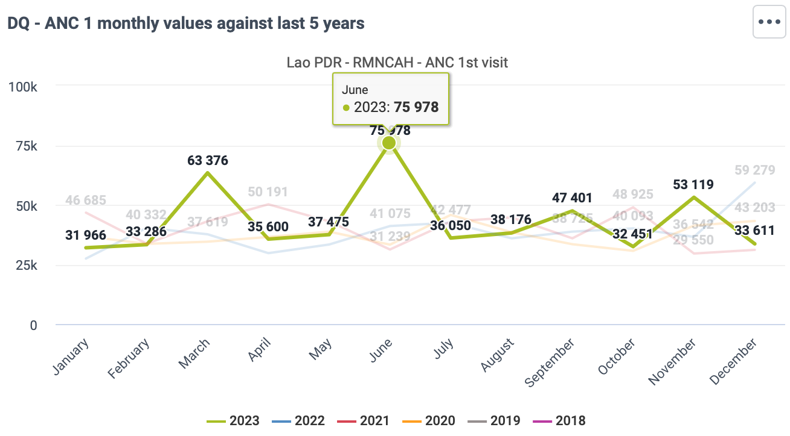
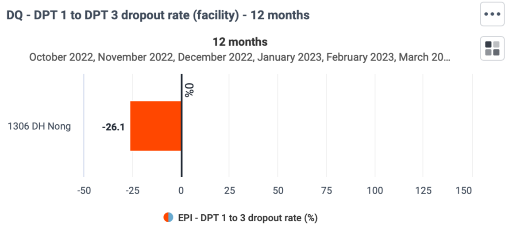
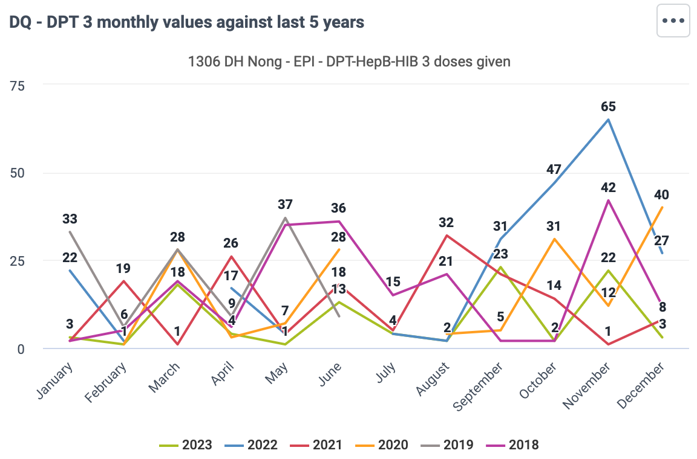
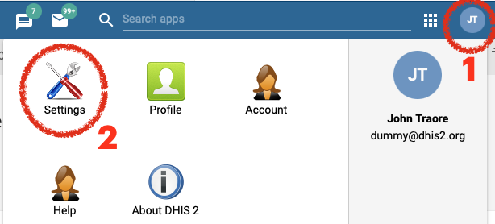
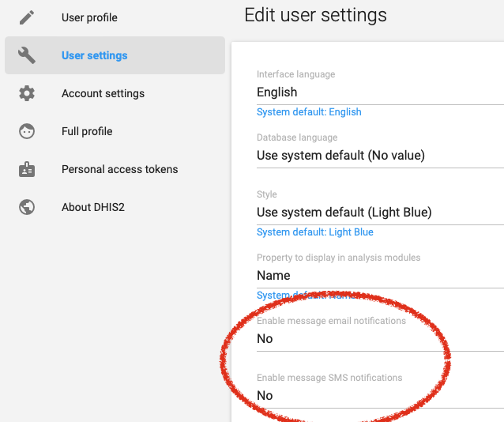

# Implementing data quality functionality and procedures

As outlined in the sections on data quality features related to [data entry](data-quality-02-data-entry.md) and [analysis](data-quality-03-analysis.md), there is a plethora of functionality for ensuring data quality in DHIS2. However, the existence of functionality does not automatically lead to them being used. This section discusses approaches to increase uptake of this functionality. We cover three topics related to this:

1. [Automating data quality analysis through dashboards and validation notifications](#automated-data-quality-analysis)
2. ["Minimum requirements" for implementation of data quality functionality in DHIS2](#minimum-standards-for-data-quality)
3. [Standard operating procedures (SOPs) on data quality for use at different levels of the health system](#standard-operating-procedures)

## Automated data quality analysis

To encourage users to review data quality on a routine basis, data quality functionality must be easily available and "pushed" to users as much as possible. In DHIS2, there are primarily two ways of doing this:

-   Configuring and sharing dashboards with users that provide ready-made data quality analytics.
-   Using the validation rule notifications functionality to notify users of severe validation rule notifications.

### Data quality dashboards

Dashboards with data quality metrics is the main way in which automated data quality analysis can be pushed to users. As discussed below on [minimal standards](#minimum-standards-for-data-quality), different groups of users should each have access to automated data quality analysis through dashboards designed specifically for their needs. In planning and designing dashboards for different users groups, there are several issues that need to be considered.

#### Selecting core indicators

Many of the more in-depth data quality metrics we can define in DHIS2 requires a substantial amount of configuration work and additional metadata (such as predictors, data elements to store calculations, and indicators) for every core variable we want to be able to assess. This means that such metrics can realistically only be done for a set of core indicators. The [WHO DQA toolkit](https://www.who.int/data/data-collection-tools/health-service-data/data-quality-assurance-dqa) provides a list of core indicators for certain health programmes, which together with core indicators defined in national M&E plans provide a good starting point in terms of what variables to prioritize. This also means that while dashboards can give an overview of data quality issues and more in-depth information for certain key variables, users must still be [trained]((#minimum-standards-for-data-quality)) in how to use other data quality functionality, and there should be [SOPs](#standard-operating-procedures) outlining what data quality-related activities they should perform routinely.

#### Operational or analytical focus

The second element to consider is to what extent the automated dashboards should be designed to be operational vs analytical tools, or a combination. At the district and facility level, where users are directly responsible for entering accurate data in a timely fashion, dashboards can be designed to be more operational. For example, highlighting specific data values flagged as potential outliers, or individual facilities that have not yet reported for the current period. For analysts at national level, needs are more likely to be around assessing whether the data is of an acceptable quality to make informed decisions based on it. Thus seeing individual outlier values is less relevant, but a measure of what proportion of the reported data values are potential outliers is relevant for the analysis. Analytics can also have an operational focus at higher levels, such as being able to monitor trends or make geographical comparisons of data quality issues so that interventions can be made.

#### Customizing for groups of users

Dashboards should be tailored to and shared with groups of users with similar information needs and roles in relation to data quality. Technically, it is easy in DHIS2 to provide all users with access to a large number of dashboards by using the [sharing](https://docs.dhis2.org/en/use/user-guides/dhis-core-version-master/configuring-the-system/about-sharing-of-objects.html?h=sharing+master+use) functionality to make them *public* (to all users); however, while a set of public dashboards could be developed covering all key aspects of data quality, it is less likely that users will find and review the information available in a set of dashboards if only a small subset of this information is relevant to them. Key groups of users should therefore be identified for which tailored, automated analytics can be developed in the form of dashboards.

Two dimensions are key in defining these groups of users: the level of the health system at which users are based (national, district, facility etc), and the health area(s) for which they work. The two are closely related, since users at higher levels are typically more specialized in terms of health area/programmes, whilst users at lower levels have broader responsibilities. For example, in a small facility, one or two people might be responsible for data and reporting for all health services, in the district there could be people responsible both for the cross-cutting HMIS reporting as well as more specialized focal points for specific programmes, whilst at national level each health programme might have a team of data analysts.

When considering what user groups to target in terms of DHIS2 data quality dashboard requirements, it is important to keep in mind that individual users can be part of multiple groups of users - both in their actual work, and technically in terms of user groups in DHIS2. For example, if two data quality dashboards have been developed specifically for monitoring Malaria data quality and to provide key data quality metrics for districts, users working in a district that are also responsible for malaria should have access to both dashboards (i.e. be part of both "district users" and "malaria programme users" groups). Assuming *relative* orgunits and [*relative* periods](https://docs.dhis2.org/en/use/user-guides/dhis-core-version-master/understanding-the-data-model/about-data-dimensions.html?h=relative+master+use#relative-periods) are used according to best practice for visualization and dashboard design, the same dashboards can often be re-used both at national and sub-national level. The exception is at the facility level, since any analysis involving comparisons across multiple organizational units will not work well for facility users.

#### Data quality dashboard examples

As references to how DHIS2 data quality functionality can be implemented, example data quality dashboards are available in the integrated [HMIS demo database](https://demos.dhis2.org/hmis/dhis-web-dashboard/#/c6L3VVdHTGK) environment maintained by the HISP Centre. These dashboards generally follow the data quality principles outlined in the [data quality principles](data-quality-01-principles.md) section and the [WHO DQA framework](https://www.who.int/data/data-collection-tools/health-service-data/data-quality-assurance-dqa); however, given that the focus is on *routine* monitoring (e.g. monthly/quarterly), the data quality checks around denominator consistency and external consistency (e.g. with household surveys) are not included since these change at most annually under normal circumstances.

Apart from external consistency checks, the dashboard examples provides metrics on each of the key data quality dimensions:

-   completeness and timeliness of data, at the data set and data element level

-   consistency between related data

-   consistency over time (outlier detection)

Four indicators are used in the example dashboards, based on the core indicators recommended in the [WHO DQA framework](https://www.who.int/data/data-collection-tools/health-service-data/data-quality-assurance-dqa) (the fifth core indicator, TB notifications, has not been included in the initial version of the dashboards due to limitations of the data available in the HMIS demo database).

##### National to district level

The dashboard "DQ - Data Quality Core" is available in the [HMIS demo database](https://demos.dhis2.org/hmis/dhis-web-dashboard/#/c6L3VVdHTGK) using the following login details:
-  Username : demo_en / Password: District1#
-  Username : demo_dq_district / Password: District1#
    
The dashboard is best reviewed by logging into DHIS2, but a summary of the key components of the dashboard is provided here.

**Completeness**

*Line charts* showing the 12-month trend for the core indicators:

-   Reporting completeness (per data set)

-   Facilities reporting consistently the previous 12 months

*Single value charts* for each core indicator, for the last month:

-   Data element completeness

-   Facilities reporting consistently the previous 12 months

*Tables* with key completeness/timeliness metrics for the last month, comparing orgunits (at user's level and below). One table is included for each core indicator. Uses a customized legend set to color cells according to completeness.

**Consistency of related data**

*Scatterplots* showing the core variables against a related variable, across multiple organization units (one level below the user). The outlier detection is enabled, highlighting orgunits with value more than 3 SD from the median using a modified z-score method.

*Dropout rates* (for variables where applicable) over the last 12 months, presented with a column chart sorted from low to high with negative values highlighted and a corresponding table listing the organization units with negative values.

**Consistency over time**

*Year-over-year charts* for each variable, showing the monthly values for the current year and the preceding 5 years.

*Value excluding outliers* for each of the four variables:

-   Single value charts for the last month

-   Table with values for the last 12 month, with legend set applied

*Table with large outliers* for each of the variables in the last 3 months for orgunits below the user' level, with legend set applied according to size of the outlier.

##### Facility level

The dashboard "DQ - Data Quality Core" is available in the [HMIS demo database](https://demos.dhis2.org/hmisdq_dev/dhis-web-dashboard/#/u9bbWIfAX5o) using these login details:
- Username: district_dq_facility / Password: District1#

The dashboard is best reviewed by logging into DHIS2, but a summary of the key components of the dashboard is provided here.

**Completeness**

*Tables* with key completeness/timeliness metrics for the 12 last month (one table for each core indicator), showing:

-   Data set expected reports: 1 if the facility is supposed to report, 0 otherwise

-   Data set actual reports: 1 if the facility has marked the data set as complete, 0 otherwise

-   Data set actual reports on time: 1 if the facility has marked the data set as complete before the reporting deadline, 0 otherwise

-   Variable value (e.g. ANC 1st visits): the actual data value, to directly assess the data element completeness

Uses a customized legend set to highlight values of 0, but in a neutral color since some facilities are not expected to report on all key variables.

**Consistency of related data**

*Dropout rates* (for variables where applicable) over the last 12 months, presented as a single column chart with negative values highlighted and a corresponding table listing the organization units with negative values.

**Consistency over time**

*Year-over-year charts* for each variable, showing the monthly values for the current year and the preceding 5 years.

*Table with large outliers* (values of 10+ only) for each of the variables in the last 12 months for the user's orgunit, with legend set applied according to size of the outlier.

*Charts comparing reported values with the calculated outlier* for each of the variables in the last 12 months for the user's orgunit.

#### Dashboards from WHO toolkits

As part of the health data toolkits, data quality dashboards are being included for specific health programmes. These are valuable resources that should be reviewed when implementing data quality dashboards for each respective area. Currently, the [Malaria data quality dashboard](https://docs.dhis2.org/en/topics/metadata/malaria/malaria-hmis/design.html#malaria-data-quality-dashboard) has been published and is available in the [HMIS demo database](https://demos.dhis2.org/hmis/dhis-web-dashboard/#/xRjeIawqMbW). Data quality dashboards for TB and HIV are in development, and will be published and made available in the HMIS demo database by the end of 2023.

### Validation rule notifications

Dashboards are the main way of providing automated data quality analysis to users. However, validation rule notifications can also be used for this purpose, and be a useful complement if configured correctly. Depending on how DHIS2 is configured, validation rule notifications can be set up so that users receives messages within DHIS2, email or SMS if a certain logical test is true. For data quality, this means that a value is above a certain threshold so that it is flagged as a potential outlier.

Implementation of this functionality needs to be managed carefully, since sending too many messages can lead to people stopping to pay attention. This is particularly true if notifications:

-   are sent to people for whom the message is not relevant (i.e. they have no responsibility for checking/correcting the potential error)

-   include too many false positives (i.e. values that turn out not to be data quality errors)

-   are not significant enough to warrant sending out a dedicated message

Validation rule notifications should therefore be used with caution for data quality monitoring, and is best suited for very high priority variables for which there have been consistent problems with data quality.

### Reference - data quality metrics

Below is a reference list of the data quality metrics and analytics that can be configured in DHIS2 and provided as automated analysis through dashboards or push notifications, for a single variable.

**Completeness**

-   Data set completeness and timeliness.

-   Data element completeness. Can be configured with different measures for the denominator ("expected reports").

-   Orgunits/facilities consistently reporting

**Consistency between related data**

-   Scatterplots, against a related variable

-   Charts highlighting negative dropout rates (where applicable)

**Consistency over time**

-   Year-over-Year charts for visually identifying outliers

-   Outlier measure

    -   Overall value excluding outlier values

    -   Count and proportion of outlier values

    -   Lists of outlier values by period/organization units

-   Notifications (DHIS2 message, email or SMS) if values our over outlier threshold

## Minimum standards for data quality

DHIS2 has a wide range of functionality for ensuring and assessing data quality; however, much of this requires configuration by the DHIS2 core team, and it must be made available for end users. Beyond the DHIS2 configuration, it is essential that the training provided to end users of DHIS2 includes data quality functionality and that there are SoPs for staff at all levels that clearly states what their role is in ensuring that data is of good quality. This section outlines what we consider a minimum of configuration and implementation standards for ensuring data quality.

### Data entry configuration

-   Validation rules configured for all data sets currently in use, covering all data elements where it is possible to define logical comparisons according to validation rule best practices.

    -   Health data toolkits provide a reference with recommended validation rules for several health programmes.

-   Data sets that have been used routinely for at least one year with reasonable reporting completeness should be considered for generation of min-max values.

    -   Alternative methods than the built-in "min-max value generation" feature should be used

### Dashboards and indicators

-   Data quality indicators should be configured for (at least) high-priority MoH/health programme indicators:

    -   Data element completeness

    -   Facilities consistently reporting

    -   Data excluding outliers

-   Data quality dashboards should developed and made available to all users, according to their data quality analysis needs

    -   Data quality dashboards from health data toolkits should be reviewed as reference

### User roles and access

-   Users should have access to the core "Data quality" application, and other data quality applications that are installed/configured (e.g. WHO Data Quality Tool). This includes:

    -   As a minimum, all users responsible for entering and validating data

    -   Unless there are clear arguments otherwise, other users with data analysis access

### Other configuration

-   WHO Data Quality Tool installed and configured to support annual data quality reviews

-   Validation rule notification considered (actually implementing this is *not* considered part of a minimum data quality standard)

    -   Notification options (email and/or SMS) configured if using validation rule notifications

### Training and job aides

-   Training curriculum and material for staff using DHIS2 should cover use of data quality functionality

-   Job aides, user manuals and other resources available to users should include cover data quality functionality

### Standard Operating Procedures

-   SOPs for data quality should be defined and available to users

    -   This could be a dedicated SOP for data quality, or data quality could be embedded in SOPs for data collection and/or data analysis

## SOP for data quality

SOPs covering data quality should be available for users working with data at all levels of the health systems. The SOPs should outline *who* would do *what*, *when* - and *how* it should be done. This means that the key roles related to data quality must be defined, and the responsibilities of each role. Example of data quality-related activities that should be described include:

-   What actions should be taken if validation rule or min/max violations occur during data entry?

-   When should data be reported by, and when should it be reviewed by?

-   What are the steps that should be taken by different levels of the health system in order to review the data

-   What should be done when an incorrect value or outlier is identified?

Data data quality SOP have to be developed according to the context and established procedures in each implementation. However, a data quality SOP template is available [here](https://docs.google.com/document/d/1w9bhvCEgewrKLSNsizfpPBoAv2WCd3aM9wzbt3x4yHE/edit?usp=sharing) which can be a starting point for the development of a country-specific version.

## Key Maintenance Operations

In order for the data quality functionality described here to function as intended, certain underlying functionality must also be set up.

### Scheduling

Several data quality metrics rely on use of predictors to perform underlying calculations. In the case of outliers, two sets of predictors are needed: first to calculate outlier thresholds, then to evaluate data against these thresholds. Predictors must be scheduled using the [Scheduler app](https://docs.dhis2.org/en/use/user-guides/dhis-core-version-master/maintaining-the-system/scheduling.html?h=scheduler+master+use#scheduling), and it should run so that it is finished before the analytics table generation job takes place, typically every night.

Scheduled jobs cannot be chained together so that one job starts when the previous one is completed. Thus to ensure that the required jobs run in the correct order, you must measure the time it takes for each job to finish and schedule them accordingly.

Here is an example of generating the predictors and using them for analysis

In this second example, we can add the monitoring job for the use of validation rules and notifications

In the below example, predictors to calculate data quality thresholds starts at 23:00 and finishes in about 15 minutes. Predictors to calculate other data quality metrics starts at 23:30 and takes 45 minutes. Finally, the analytics table update jobs starts at 02:00. ***Perform tests carefully in a development system to track the amount of time each job takes and schedule them accordingly.***

### Email and SMS Notifications settings

Messages, whether direct messages sent by users, validation notifications or system notifications are by default sent as internal DHIS2 messages. For these messages to also be forwarded via email and/or SMS, DHIS2 needs to be configured appropriately and the user needs to enable email/SMS notifications.

#### Email Configuration

For DHIS2 to send email notifications, an SMTP server needs to be configured under [system settings](https://docs.dhis2.org/en/use/user-guides/dhis-core-version-238/configuring-the-system/system-settings.html?h=smtp+2.38#system_email_settings). Any mail provider offering an SMTP service can in principle be used for this. [A tutorial](https://docs.dhis2.org/en/topics/tutorials/setting-up-email.html?h=smtp+tutorials#setting-up-email-on-a-server) is also available to set up an email service on DHIS2 host server.

#### SMS Configuration

For DHIS2 to send (and receive) SMS messages, an [SMS gateway](https://en.wikipedia.org/wiki/SMS_gateway) needs to be configured. Alternative options for SMS gateways for DHIS2 are discussed [here](https://docs.dhis2.org/en/manage/performing-system-administration/dhis-core-version-238/using-gateways-for-sms-reporting.html#sms_report_android_gateway). [Using an android device as a gateway](https://docs.dhis2.org/en/manage/performing-system-administration/dhis-core-version-238/using-gateways-for-sms-reporting.html#sms_report_android_gateway) is technically possible, but only recommended for testing and small-scale pilots. [Dedicated SMS gateways](https://docs.dhis2.org/en/manage/performing-system-administration/dhis-core-version-238/using-gateways-for-sms-reporting.html#sms_report_dedicated_gateway) are typically offered by commercial providers or mobile operators (for a fee), and these service providers will provide the parameters needed to configure the gateway.

The specific steps to configure SMS gateways in DHIS2 are described [here](https://docs.dhis2.org/en/use/user-guides/dhis-core-version-238/maintaining-the-system/configure-sms.html?h=#sms-configuration-gateways), with additional details [here](https://docs.dhis2.org/en/use/user-guides/dhis-core-version-238/maintaining-the-system/mobile.html#mobile_sms_service).

#### Enabling and disabling notifications

It is up to each user to choose to enable/disable forwarding of these messages also to SMS or email (assuming these have been configured as described above). This is done by opening Users settings from the DHIS2 menu bar and turning each option for SMS/email on or off (set the settings to "Yes" in order to enable them).

